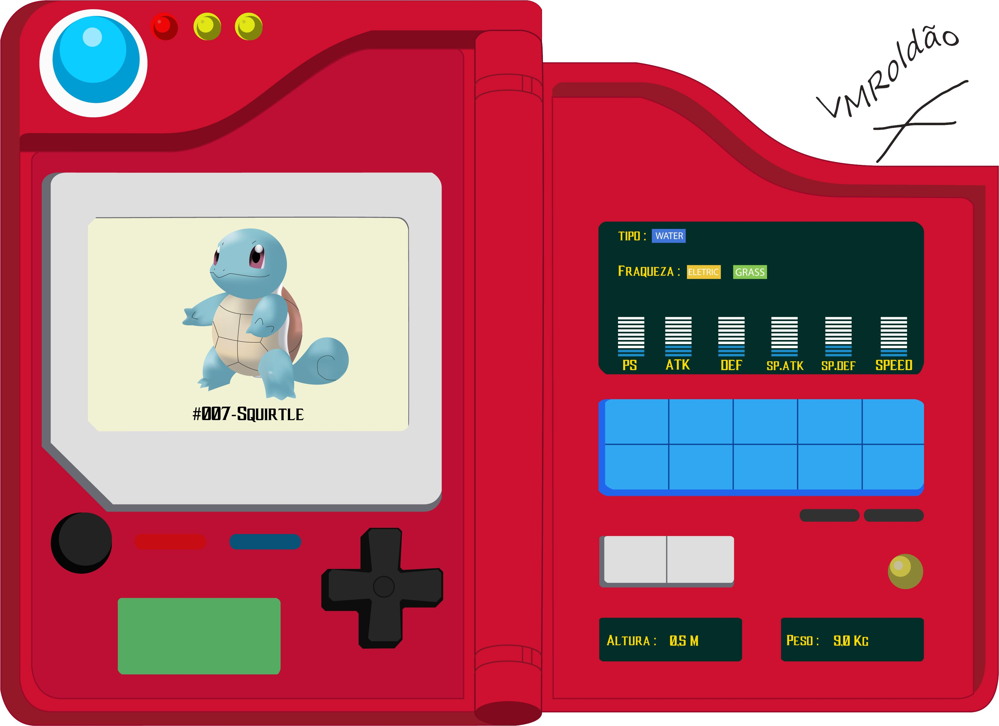

# Practica-js
Práctica Js LauncherLatam

    Práctica como parte de los temas vistos en el LauncherLatam. Se realizo una 
    Pokedex usando CSS & JS. De igual modo se trato de hacer responsive para
    mobile first.

**Los requisitos son los siguientes:**
* Maquetación del sitio con HTML
* Diseño con CSS para que parezca un pokedex la página.
* Tener un input de entrada
* Mostrar en pantalla los siguientes datos del pokemón ingresado:
  * Nombre
  * imágen
  * Tipo de pokemón




Parte del desafio que se presento fue usar nuevas tecnicas que no se habian visto anteriormente, como es el uso de linear-gradient.
```CSS
body{
    margin: 0;
    padding: 0;
    background: linear-gradient(to right, #333399, #ff00cc);
    height: 100vh;
    color: #f8e004;
}
```

Una tecnica que se uso en esta práctica fue hacer una esfera en la que la sombra quede adentro usando (inset) y que esta tenga una animación.

```CSS
.esfera{
    width: 10%;
    height: 70%;
    float: right;
    border-radius: 100%;
    background: #c6bb47;
    box-shadow: -9px -8px 4px #8b8635 inset;
    transition-duration: 0.3s;
}
.esfera:hover{
    background: #8b8635 ;
    box-shadow: -9px -20px 4px #c6bb47 inset;
}
```
Para el js se hace una consulta y en caso que el valor ingresado no sea valido se muestra un gif de pikachu
```javascript
const fetchPokemon = () => {
    const pokeNameInput = document.getElementById("pokeName");
    let pokeName = pokeNameInput.value;
    pokeName = pokeName.toLowerCase();
    const url = `https://pokeapi.co/api/v2/pokemon/${pokeName}`;
    fetch(url).then((res) => {
        if (res.status != "200") {
            console.log(res);
            pokeImage("./gif/pikachu-sad.gif")
        }
        else {
            return res.json();
        }
    }).then((data) => {
        if (data) {
            console.log(data);
            let pokeImg = data.sprites.front_default;
            let pokeInfo = data.abilities;
            pokeImage(pokeImg);
            pokeData(pokeInfo);
            console.log(pokeImg);
        }
    });
}
```


para mostrar las habilidades del pokemon segun el nombre ingresado.
```javascript
const pokeData = (abilites) => {
    const pokeAbilities = document.getElementById("abilities");
    const abilitiesName = abilites.map((item) => item.ability.name);
    pokeAbilities.innerHTML = abilitiesName;
};
```
